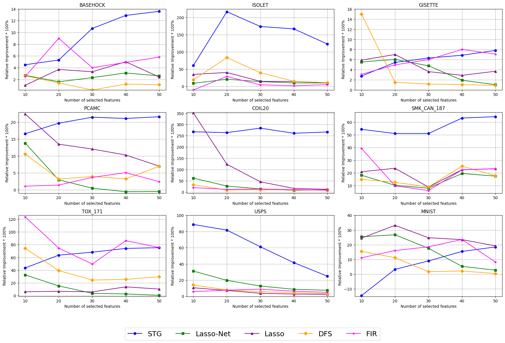

# ICML2025

**Figure 1.** Two analytic neural networks without hidden layer.

**Figure 2. The Relative Improvement of CORAL-Net over other methods.**
For a given method a, the Relative Improvement of CORAL-Net over method a when selecting the same number of features is defined as $$
\text{Relative Improvement} = \frac{\text{Performance of CORAL-Net} - \text{Performance of method } a}{\text{Performance of method } a} \times 100\%
$$

Generally, selecting more features tends to improve prediction performance. However, since the performance has a natural upper bound, the improvement tends to diminish as more features are selected. Nevertheless, as shown in the figure, CORAL-Net still achieves significant improvement when only a small number of features are selected.

**Table 1.** Mean test performance (± standard deviation) of CORAL-MoE, sparse MoE, CORAL-MLP, and sparse MLP across four large-scale tabular datasets. Accuracy (`↑`) and RMSE (`↓`) are used as surrogate metrics for evaluating model performance over three independent runs.

| Dataset             | Performance | Sparse MoE           | CORAL-MoE           | Sparse MLP           | CORAL-MLP           |
|---------------------|-------------|-----------------------|----------------------|-----------------------|---------------------|
| Helena              | Accuracy `↑`  | 0.28 (1.02×10⁻³)      | 0.29 (5.99×10⁻⁴)     | 0.27 (4.71×10⁻³)      | 0.29 (5.56×10⁻⁴)    |
| Jannis              | Accuracy `↑`  | 0.68 (1.80×10⁻³)      | 0.68 (1.45×10⁻³)     | 0.65 (4.02×10⁻³)      | 0.67 (1.91×10⁻³)    |
| ALOI                | Accuracy `↑`  | 0.75 (2.54×10⁻³)      | 0.85 (1.83×10⁻³)     | 0.73 (3.67×10⁻³)      | 0.78 (2.48×10⁻³)    |
| California Housing  | RMSE `↓`      | 0.62 (1.71×10⁻³)      | 0.61 (1.50×10⁻³)     | 0.63 (2.97×10⁻³)      | 0.61 (1.61×10⁻³)    |

**Table 2.** Runtime (in seconds) of CORAL-Net on four large-scale tabular datasets.

| Data                        | CORAL-Net Runtime |
|-----------------------------|-------------------|
| California Housing (20640*8) | 264.57 s          |
| Helena (65196*27)           | 326.89 s          |
| Janis (83733*54)            | 407.71 s          |
| ALOI (108000*128)           | 774.99 s          |

**Table 3.** Basic statistics of the four tabular datasets used in our experiments, including number of features, number of samples, and task type.

| Dataset            | Features | Sample Size | Type                     |
|--------------------|----------|-------------|--------------------------|
| California Housing | 8        | 20,640      | Tabular / Regression     |
| Helena             | 27       | 65,196      | Tabular / Classification |
| Jannis             | 54       | 83,733      | Tabular / Classification |
| ALOI               | 128      | 108,000     | Tabular / Classification |

**Table 4.** RMSE comparison between the original CORAL-Net with linear activation and the modified version using LeakyReLU. Lower values indicate better performance.

|Performance|$x^\top \beta + h(x \circ \beta)$|$\text{LeakyReLU(x)}^\top \beta + h(x \circ \beta)$|
|--|--|--|
|RMSE`↓`|0.49 (4.06×10⁻³)|0.41 (2.16×10⁻³)|
|Precision`↑`|0.78 (0.16)|1.00 (0.00)|
|Recall`↑`|0.78 (0.16)|1.00 (0.00)|

**Table 5.** Test accuracy of CORAL-Net, LassoNet, DFS, Knockoff, and GCRNet on four large-scale datasets from the Deep Tabular Learning benchmark. All models used identical MLP architectures (hidden dim = 12), trained for 1,000 epochs with Adam optimizer and a learning rate of 0.001. Results are averaged over three independent runs on fixed train/test splits. `↑` indicates that higher values are better, while `↓` indicates that lower values are preferred. **Bold** highlights the best-performing method, and _italic_ indicates the second-best.

| Data | Performance | CORAL               | LassoNet            | DFS                 | Knockoff            | GCRNet              |
|------|-------------|---------------------|---------------------|---------------------|---------------------|---------------------|
| Helena (65196*27)   | Accuracy  `↑`      | **0.29 (5.56 × 10⁻⁴)**  | 0.18 (1.15 × 10⁻²)  | *0.27 (3.29 × 10⁻³)*  | 0.17 (1.89 × 10⁻²)  | 0.15 (1.41 × 10⁻³)  |
| Janis (83733*54)   | Accuracy     `↑`    | *0.67 (1.91 × 10⁻³)*  | 0.64 (3.10 × 10⁻³)  | **0.68 (2.22 × 10⁻³)**  | 0.57 (2.00 × 10⁻²)  | 0.34 (1.77 × 10⁻³)  |
| ALOI (108000*128) | Accuracy      `↑`   | **0.78 (2.48 × 10⁻³)**  | 0.24 (4.14 × 10⁻³)  | *0.67 (2.03 × 10⁻³)*  | 0.18 (1.12 × 10⁻²)  | 0.24 (4.98 × 10⁻³)  |
| California Housing (20640*8)   | RMSE  `↓`      | **0.61 (1.61 × 10⁻³)**  | 0.63 (1.24 × 10⁻²)  | 0.87 (6.38 × 10⁻²)  | *0.62 (8.94 × 10⁻³)*  | 0.65 (1.48 × 10⁻²)  |

**Table 6.** Test accuracy of CORAL-Net compared with STG and FIR on MNIST and USPS datasets, using 50 selected features. STG-50 and STG-500 refer to models trained with 50 and 500 epochs, respectively. FIR-500 and FIR-15000 refer to FIR models trained with 500 and 15,000 epochs. Each result is reported as the mean accuracy over three independent runs, with standard deviation in parentheses. `↑` indicates that higher values are better. **Bold** highlights the best performance, and _italic_ indicates the second-best.

| Data  | Performance | CORAL-500 (50 features) | STG-50 (50 features) | STG-500 (50 features) | FIR-500 (50 features) | FIR-15000 (50 features) |
|-------|-------------|--------------------------|------------------------|-------------------------|------------------------|---------------------------|
| MNIST | Accuracy ↑   | **0.94 (3.23 × 10⁻³)**   | 0.17 (2.01 × 10⁻²)     | _0.80 (1.63 × 10⁻²)_    | 0.58 (4.01 × 10⁻³)     | 0.86 (2.35 × 10⁻³)        |
| USPS  | Accuracy ↑   | **0.95 (5.40 × 10⁻⁴)**   | 0.28 (2.05 × 10⁻³)     | _0.77 (8.93 × 10⁻³)_    | 0.74 (1.40 × 10⁻²)     | 0.90 (2.23 × 10⁻²)        |

**Table 7.** Prediction accuracy on private medical dataset containing 340 patients and 553 features, including 37 clinical indicators and 516 urine protein expression levels. The task is to identify predictive features for patient recovery after intracerebral hemorrhage (ICH). We compare CORAL-Net with established feature selection methods including Boruta, LassoNet, DFS, Knockoff, and GCRNet, all evaluated using predefined training/test splits determined by medical professionals. Each method selects 36 variables for a fair comparison, except CORAL-Net, which achieved the best performance using only 24 variables. Notably, several variables identified by CORAL-Net align with clinically validated ICH prognosis indicators in the literature. `↑` indicates that higher values are better. **Bold** denotes the best-performing method.

| Performance | Boruta | CORAL-Net | LassoNet | DFS   | Knockoff | GCRNet |
|-------------|--------|-----------|----------|-------|----------|--------|
| Accuracy    | 0.67 (0) | 0.78 (5.84 × 10⁻³) | 0.74 (7.95 × 10⁻²) | 0.74 (6.68 × 10⁻³) | 0.72 (7.84 × 10⁻³) | 0.69 (5.67 × 10⁻³) |

