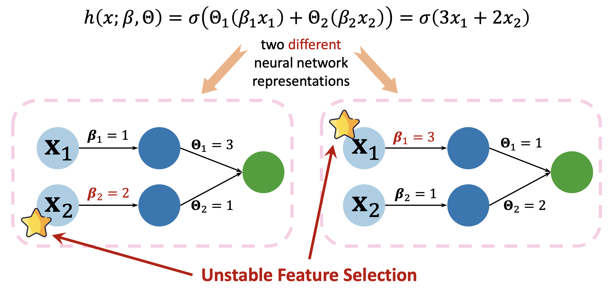

# ICML2025

**Figure 1.** Two analytic neural networks without hidden layer.

**Table 1.** Mean test performance (± standard deviation) of CORAL-MoE, sparse MoE, CORAL-MLP, and sparse MLP across four large-scale tabular datasets. Accuracy (`↑`) and RMSE (`↓`) are used as surrogate metrics for evaluating model performance over three independent runs.

| Dataset             | Performance | Sparse MoE           | CORAL-MoE           | Sparse MLP           | CORAL-MLP           |
|---------------------|-------------|-----------------------|----------------------|-----------------------|---------------------|
| Helena              | Accuracy `↑`  | 0.28 (1.02×10⁻³)      | 0.29 (5.99×10⁻⁴)     | 0.27 (4.71×10⁻³)      | 0.29 (5.56×10⁻⁴)    |
| Jannis              | Accuracy `↑`  | 0.68 (1.80×10⁻³)      | 0.68 (1.45×10⁻³)     | 0.65 (4.02×10⁻³)      | 0.67 (1.91×10⁻³)    |
| ALOI                | Accuracy `↑`  | 0.75 (2.54×10⁻³)      | 0.85 (1.83×10⁻³)     | 0.73 (3.67×10⁻³)      | 0.78 (2.48×10⁻³)    |
| California Housing  | RMSE `↓`      | 0.62 (1.71×10⁻³)      | 0.61 (1.50×10⁻³)     | 0.63 (2.97×10⁻³)      | 0.61 (1.61×10⁻³)    |

**Table 2.** Runtime (in seconds) of CORAL-Net on four large-scale tabular datasets.

| Data                        | CORAL-Net Runtime |
|-----------------------------|-------------------|
| California Housing (20640×8) | 264.57 s          |
| Helena (65196×27)           | 326.89 s          |
| Janis (83733×54)            | 407.71 s          |
| ALOI (108000×128)           | 774.99 s          |

**Table 3.** Basic statistics of the four tabular datasets used in our experiments, including number of features, number of samples, and task type.

| Dataset            | Features | Sample Size | Type                     |
|--------------------|----------|-------------|--------------------------|
| California Housing | 8        | 20,640      | Tabular / Regression     |
| Helena             | 27       | 65,196      | Tabular / Classification |
| Jannis             | 54       | 83,733      | Tabular / Classification |
| ALOI               | 128      | 108,000     | Tabular / Classification |
